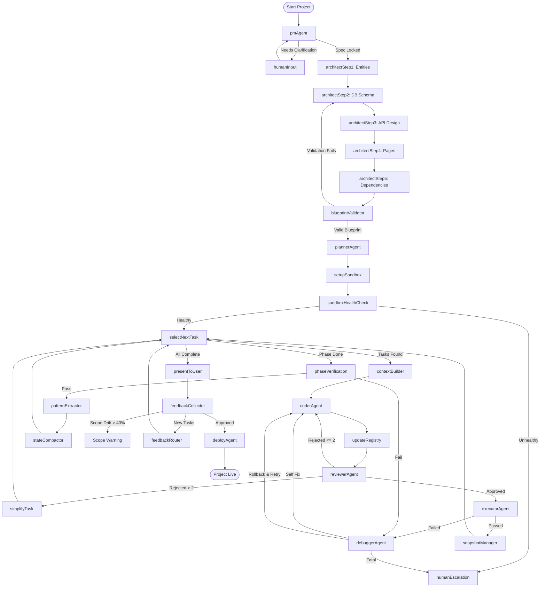

# 🤖 AgenticForge - Multi-Agent AI Software Engineering Platform (V2)

[](https://opensource.org/licenses/MIT)
[](https://nodejs.org/)
[](https://redis.io/)
[](https://ai.google.dev/)

**AgenticForge** is an autonomous, production-grade multi-agent software development system. Inspired by platforms like Devin, it manages the complete Software Development Lifecycle (SDLC)—from gathering requirements, architecting systems, creating task plans, writing code, executing builds in a secure sandbox, self-debugging, collecting feedback, to final deployment.

This repository implements the complete **V2 Architecture**, addressing common agentic loopholes like state drift, lack of rollback mechanisms, and unbounded token consumption.

---

## ⚡ Quick Start

### 1. Prerequisites
- **Node.js** 18 or higher
- **Docker Desktop** (Required for the code execution sandbox & Redis)
- **Google Gemini API Key** ([Get a free key here](https://aistudio.google.com/))

### 2. Installation
```bash
# Clone the repository
git clone https://github.com/Surajyadav9792/AgenticForge.git
cd AgenticForge

# Install backend dependencies
npm install

# Install frontend dashboard dependencies
cd dashboard
npm install
cd ..
```

### 3. Configuration
Create a `.env` file in the root directory:
```env
GEMINI_API_KEY=your_gemini_api_key_here
GEMINI_MODEL=gemini-2.5-flash
REDIS_URL=redis://localhost:6379
SERVER_PORT=3000
FRONTEND_URL=http://localhost:5173
TOKEN_BUDGET=2.0
```

### 4. Running the Application
```bash
# Start backend server & frontend dashboard concurrently
npm run dev
```
- **Frontend Dashboard:** [http://localhost:5173](http://localhost:5173)
- **Express Backend API:** [http://localhost:3000](http://localhost:3000)
- **WebSocket Server:** `ws://localhost:3000/ws`

---

## 🚀 The Multi-Agent Team (8 Specialized Agents)

| Agent | Responsibility | Output Artifacts |
| :--- | :--- | :--- |
| **1. PM Agent** | Clarifies vague user prompts, resolves ambiguity, and locks down specification. | System Specification JSON |
| **2. Architect Agent** | Designs the data models, API endpoints, folder tree, and package dependencies. | System Blueprint |
| **3. Planner Agent** | Converts the blueprint into a phased, dependency-ordered, parallelizable task plan. | Parallelized Task Queue |
| **4. Coder Agent** | Implements code changes file-by-file following strict design guidelines. | JavaScript/React Code |
| **5. Reviewer Agent** | Performs static analysis, security checks, and code pattern consistency checks. | Code Review Approval/Rejection |
| **6. Executor Agent** | Runs tests and compiles code inside a secure Docker container, returning stdout/stderr. | Build Logs & Test Verdict |
| **7. Debugger Agent** | Diagnoses run/compile errors, performs code rollback if needed, and applies fixes. | Auto-applied Bug Fixes |
| **8. Deploy Agent** | Packages the finalized application and generates production configurations. | Vercel & Render configs |

---

## ⚙️ Loophole Resolutions (V1 vs V2)

AgenticForge V2 builds on lessons from V1 tutorials, integrating production safeguards directly into the agent network:

*   **State Persistence:** Every node execution state is checkpointed to Redis. A server crash allows resuming from the exact node without starting over.
*   **Git-Backed Rollbacks:** The Docker execution sandbox maintains an internal Git repo. If a bug fix path loops or fails twice, the debugger rolls back to the last known good commit tag (`git checkout task-{taskId}`).
*   **Blueprint Self-Validation:** A separate validation agent cross-checks the database schema, endpoints, and UI routing before writing code, catching logical gaps early.
*   **Strict Code Consistency:** The system extracts style guides from early phases and dynamically injects them into the coder's prompt, preventing variable name mismatches.
*   **State Compactor:** Task queues, old test execution runs, and redundant logs are compacted once the token footprint crosses 8,000 tokens to prevent LLM context limits from blowing up.
*   **Token Budgeting:** Wraps Gemini API calls with strict pricing metrics. Halts execution if the project cost crosses the safety budget (default: `$2.00`).

---

## 📈 Platform Architecture (30-Node Workflow)



---

## 📂 Project Structure

```
AgenticForge/
├── src/
│   ├── index.js              # Command-Line Entry Point
│   ├── config/
│   │   ├── state.js          # Shared graph state schema
│   │   └── graph.js          # LangGraph definition & Redis checkpointer
│   ├── agents/
│   │   ├── pmAgent.js        # Gather requirements
│   │   ├── architectAgent.js # System blueprint design
│   │   ├── plannerAgent.js   # Deconstruct tasks
│   │   └── ...               # Additional agents (Coder, Reviewer, etc.)
│   ├── nodes/
│   │   ├── humanInput.js     # User interaction node
│   │   ├── sandboxHealth.js  # Sandbox environment check
│   │   └── ...               # Pipeline nodes (30 total)
│   └── utils/
│       ├── gemini.js         # Gemini API Integration & token estimator
│       ├── sandboxManager.js # Docker sandbox controller
│       └── tokenTracker.js   # Token expense logger
├── server/
│   ├── index.js              # Express API Server
│   ├── routes/projects.js    # REST endpoints for dashboard control
│   └── ws/handler.js         # WebSocket bridge for real-time dashboard logs
├── dashboard/                # Vite + React Dashboard UI
└── tests/                    # Independent Agent Unit & Mock Tests
```

---

## 🛠️ Technology Stack Breakdown

*   **Workflow Engine:** `LangGraph (JS)` handles complex cyclical graph logic, conditionals, and checkpoints.
*   **Generative AI:** `Google Gemini API` (specifically tuned with `gemini-2.5-flash` for high context speed and json accuracy).
*   **Docker Container Sandbox:** Isolate executing code runs, dynamic server startups, and database connections.
*   **Persistence:** `Redis` holds execution graph states so long-term development runs can be paused and safely resumed.
*   **Real-time Layer:** `WebSockets (ws)` enables live terminal logs, token graphs, and agent highlight animations on the frontend.

---

## 🧪 Testing and Verification

Ensure the setup is correct by running the included validation tests:

```bash
# Run unit tests on the graph routing (without using API quota)
npm run test:graph

# Test PM Agent end-to-end (requires real GEMINI_API_KEY)
npm run test:pm

# Test the Sandbox Manager (Docker container spin-up check)
npm run test:sandbox
```

---

## 🧠 Research & Conceptualization

This project is the result of dedicated research, extensive planning, and intensive coding. The core multi-agent architecture was conceptualized by brainstorming and discussing complex workflow patterns across ChatGPT and Gemini to solve critical agentic loop issues. The entire codebase was then systematically co-engineered and implemented in collaboration with **Claude**, ensuring clean, production-grade state management and sandbox security.

---

## 👥 Developer

* **Suraj Yadav** — [GitHub Profile](https://github.com/Surajyadav9792)

---
*Developed with ❤️ as a collaborative, multi-day development streak. Check [COMMIT_PLAN.md](COMMIT_PLAN.md) to view the daily progress calendar.*
